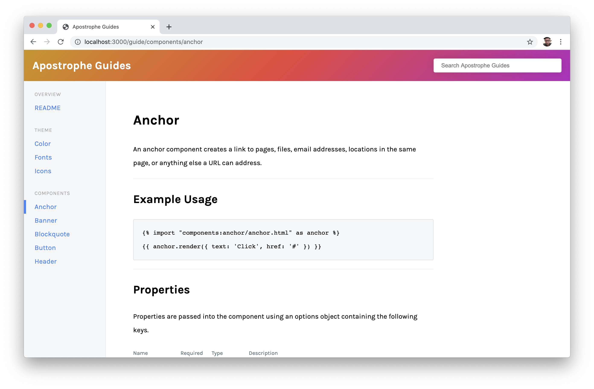
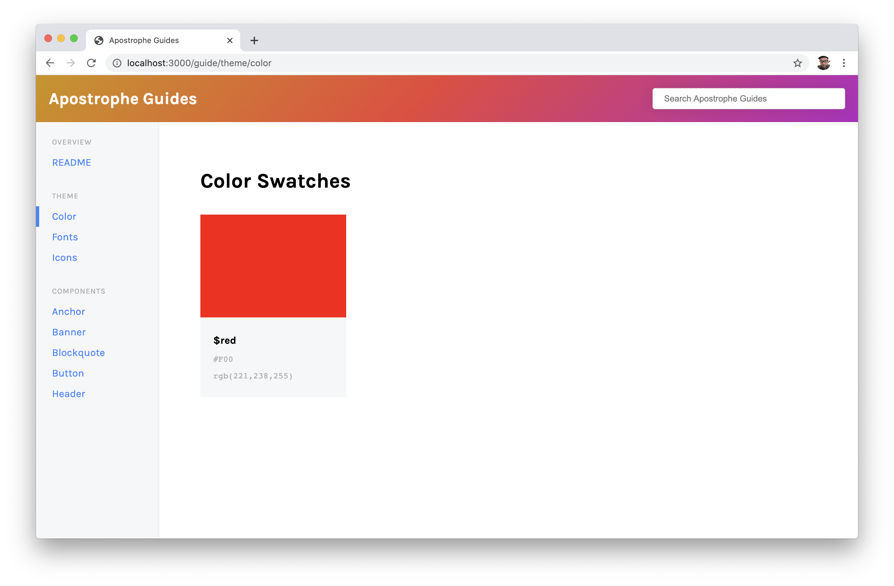
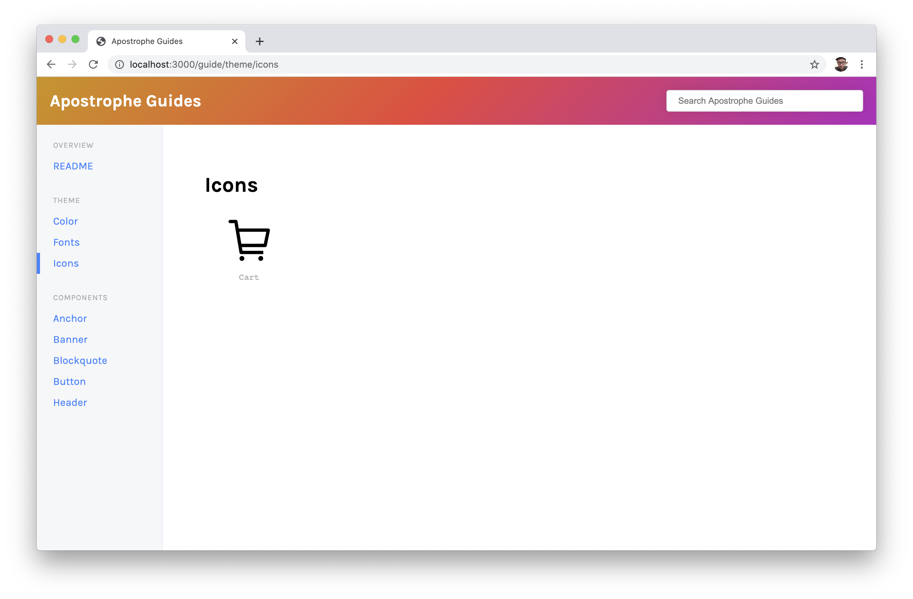

# Apostrophe Guides

> Build guides to document your Apostrophe site.

1. [Why](#why)
1. [Getting Started](#getting-started)
1. [Options](#options)
1. [Writing Documentation](#writing-documentation)
1. [Adding Images](#adding-images)
1. [Documenting Assets](#documenting-assets)
1. [Colors](#colors)
1. [Fonts](#fonts)
1. [Icons](#icons)
1. [Components](#components)
1. [Customizing your Guide](#customizing-your-guide)



## Why

So, why would you use this? Maybe you're developing an Apostrophe site and you want to provide documentation for other developers. Maybe you want to document your Design System to better collaborate with your team. Maybe you want to create a User Guide so editors have a reference on how to use the site. Maybe you want to do all three.

This module allows you to write your documentation in static Markdown and serves them right alongside your Apostrophe site. And because this is an Apostrophe module, you can document your components same way you'd use them in you templates and they'll automatically be kept up to date with your living code.

Create one guide or individual guides for each of your audiences. It's up to you.

## Getting Started

```sh
npm install apostrophe-guides
```

After the module has installed, enable it in your `app.js`;

```js
modules: {
    "apostrophe-guides": {}
}
```

## Options

### title

- Required: `N`
- Default: `Guide`

The title of your guide.

### sections

- Required: `Y`

Your guide content.

Each section is comprised of a `name` and an array of `docs`. Filenames and [globs](https://www.npmjs.com/package/glob#glob-primer) are allowed in docs. If the `.md` extension is omitted from the glob, we'll make sure only to look for Markdown files in the specified directory.

Example:

```js
'apostrophe-guides': {
    sections: [
        {
            name: "Overview",
            docs: [`${__dirname}/README.md`, `${__dirname}/Overview.md`] // Files
        },
        {
            name: "Components",
            docs: ["lib/modules/components/views/**/*.md"] // A glob
        }
    ]
}
```

### path

- Required: `N`
- Default: `guide`

The URL of your guide. If your site is running on `http://localhost:3000`, by default your guide will be available on `http://localhost:3000/guide`. If you set this option set to `styleguide`, your guide would be `http://localhost:3000/styleguide`.

### demoBodyClass

- Required: `N`

If you are including demos of your components in your guide and are using a css body class to scope your styles, this will add the specified class to the `body` element of `iframe`-d demo sandbox. More on those [later](#components).

### stylesheets

- Required: `N`

An array of stylesheets that should be included in your demo sandbox.

### scripts

- Required: `N`

An array of scripts that should be included in your demo sandbox.

### footer

- Required: `N`

Add text to the footer of all documentation pages. Useful if you'd like to provide contact information. This may be specified as a html string in the config as a path to a Nunjucks template.

As a string:

```
'apostrophe-guides': {
    ...
    footer: "Contact <a href='mailto:me@mail.com'>me</a> for more information"
}

```

As a template:

```
'apostrophe-guides': {
    ...
    footer: "apostrophe-guides:guideFooter.html"
}

```

## Writing Documentation

All documentation is written in Markdown with some added bonuses. Check [Markdown Guide](https://www.markdownguide.org/extended-syntax/) for a reference on how to write Markdown. In addition to the basics, you may also include [tables](https://www.markdownguide.org/extended-syntax/#tables) and [code blocks](https://www.markdownguide.org/extended-syntax/#fenced-code-blocks).

### Adding Images

Use the standard Markdown syntax to add an image to your page.

```

```

With the above example, your images would be placed in the `/public/guides` folder of your project.

### Documenting Assets

We've also created a few Markdown-like shortcuts to allow you to visualize some special assets like Color, Fonts, Icons, and Components.

#### Colors

To document a color, use the `swatch` block.

```
[swatch name="$red" hex="#F00"]
```

You may specifiy the color value as `hex` or `rgb` but you don't need to provide both.

An example swatch:



#### Fonts

To add examples of the typefaces in your documentation, use the `font` block.

```
[font name="Helvetica" family="Helvetica, san-serif" weight="bold"]
```

If a `name` attribute is not provided the `family` will be used as the description of the typeface. You may also optionally include, a `weight`, `size`, and desired `text`. If no `text` is provided `text` will default to the `family`;

An example font:


_Note:_ In order to preview custom fonts, you might need to add a link to your font definition.

Ex:

```html
<link href="https://fonts.googleapis.com/css2?family=Karla:ital,wght@0,400;0,700;1,400;1,700&display=swap" rel="stylesheet">

# Fonts

[font family="Karla"]

```

#### Icons

To add examples of your icons, use the `icon` block.

```
[icon name="Cart" src="/images/cart.svg"]
```

Minimally provide a path to the `src` of you icon. This currently supports any image that can be rendered in an `img` tag.

An example icon:



#### Components

To document your components, you can use a slightly modified version of the standard Markdown `code` block.

````md
```html button-simple.html

{{ button.render({ text: 'Click' }) }}
```
````

This will do two things on your guide page. First, it will render a code block that shows how another developer exactly how they would implement your component. Secondly, it generates a html file that will be rendered in an iframe on the page. This provides a live working example of your component in a sandboxed environment right in your documentation. Just be sure to include the `.html` extension on your example file name.

Your demo code could be a Nunjucks `macro`, a Nunjucks `include`, or even plain old static html. Be sure to configure the `stylesheets` and `scripts` options with the assets necessary to render your components. Additionally if you are scoping your css to a class on the body element, you can use the `demoBodyClass` option to include your class name on all component examples.

An example of a component guide page:


_Note:_ Demos are rendered at the end of your documentation page by default. This is currently not configurable.

## Customizing Your Guide

This module follows the standard Apostrophe modular system so that means **everything** can be customized to your needs. If you're ok with the layout but maybe just want to maybe brand your guide, the styles can be overwritten by creating a  local `always.css` file in your `apostrophe-guides/public/css` directory. A custom class is also applied to a guide based on the `title` option. This allows you to have multiple guides with multiple themes in a single apostrophe instance.

Additionally, you can modify any of the guide templates by coping the template you wish to modify from `node_modules/apostrophe-guides/views` to your project's `lib/modules/apostrophe-guides/views` directory.

Just note that you only need to copy the files you wish to modify to your local `apostrophe-guides` directory. You do not need to copy them all.

Happy documenting!
